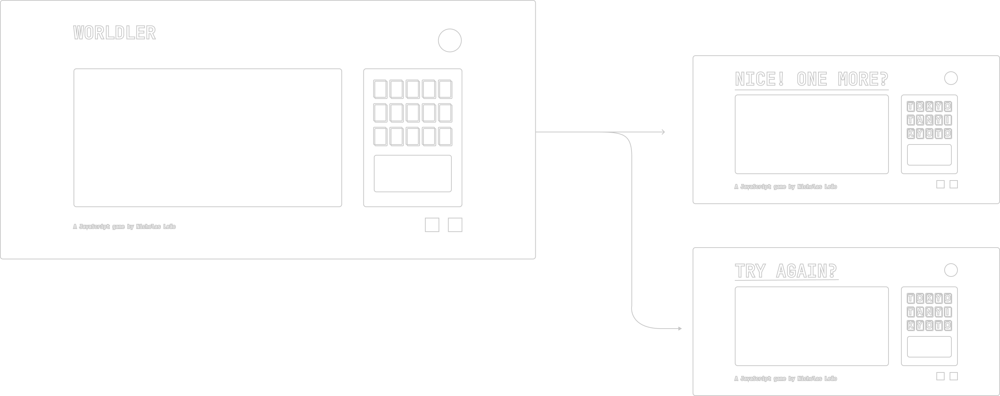
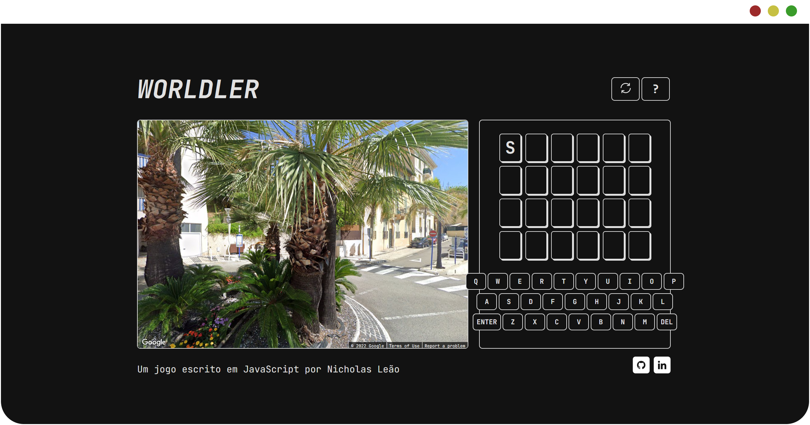

# _WORLDLER_
A wordle clone using the Google Javascript API in which you must discover the name of the city based on a random Street View panorama. It
was implemented in vanilla JS for my first project at the Web Dev bootcamp in Ironhack São Paulo.

### FEATURES
- Randomized street view panoramas based on latittude and longittude data parsed from the google Geocoding API.
- Adaptive wordle clone that manipulates the DOM according to secret word´s length.
- Expandable to different datasets, making it very easy to include only the cities of one country.

### DIFFICULTIES + CHALLENGES
This was a learning project in which we were tasked with making a game and I took it as an opportunity learn how to play with Google APIs. It
gave me a better understanding of the complexities surrounding assynchronous JavaScript and Object Oriented code. In the future I will circle back to
this project and give it a suitable back-end in order to make it more customizable and game-ified.

